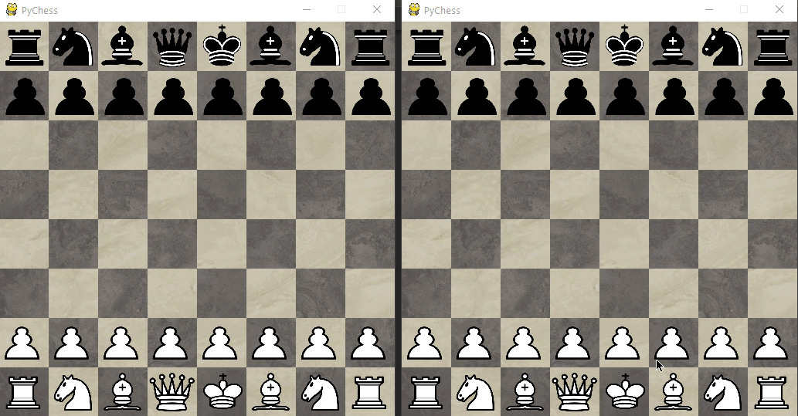

# PYCHESS

> Online chess game with python.

Implementation of the hangman game in Pygame. With the ability to ask today's word, most used & searched words and bunch of other fun options to play.

## Table of Contents

* [Installation](#Installation)
* [Release History](#Release-History)
* [Meta](#Meta)
* [Contributing](#Contributing)

## TODO's

* Add Menu
* Add Music
* Complete program cleaner

## Release History
  
  Version : 0.1

## Meta

Doğukan Demir – [@mastermachina](https://github.com/mastermachina) – slayerdogukan@gmail.com

Telegram - Maestro_20

a licence won't add. If you want to use the program in your project, please touch with me on mail
